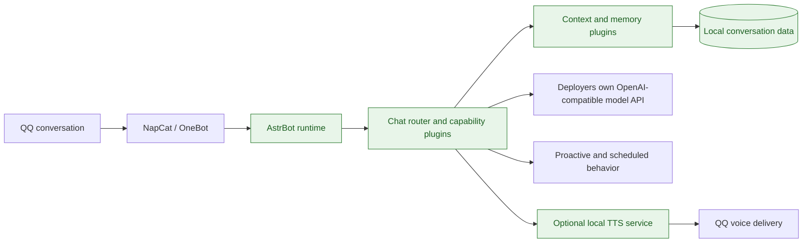

# Xiaoning — a self-hosted QQ AI assistant for Windows

> 中文速览：小柠把 QQ、NapCat、AstrBot 插件和部署者自带的模型 API 组合成可在 Windows 本机运行的 AI 助手。它优先保护账号、聊天记录和密钥：运行数据不进入 Git，服务默认只监听本机回环地址。

Xiaoning is an opinionated, self-hosted assistant for QQ. It is designed around a simple constraint: automation is useful only when the account holder retains control of credentials, conversations, delivery status, and local services.

## Why it is interesting

- **A real messaging boundary:** NapCat/OneBot bridges QQ events into an extensible AstrBot runtime instead of exposing a model directly to the network.
- **Behavior is composable:** routing, context, memory, proactive behavior, links, media, and optional voice are isolated plugins rather than one monolithic prompt.
- **Delivery is evidence-aware:** downstream media work is not described as complete merely because a provider returned an HTTP success.
- **Windows-first deployment:** bootstrap scripts and local service configuration target the environment in which the bot is actually operated.

## Architecture at a glance



**Trust boundary.** API keys, NapCat login state, attachments, logs, and local databases remain machine-local and are ignored by Git. Model access is configured by the deployer; this repository never supplies a shared key.

## Verification

```powershell
py -3.12 -m pytest -q
ruff check astrbot/data/plugins --select E9,F63,F7,F82
```

For a meaningful end-to-end check, confirm that a test account can receive and open a response in QQ. Local process health and OneBot message IDs alone do not prove recipient-visible delivery.

## Related work

- [DEEP Open Education Platform](https://github.com/tomerose/deep-camp-platform) — evidence-first workflows for education.
- [SkillTrace](https://github.com/tomerose/qoderwork-skilltrace) — consent and evidence layers for AI automation.
- [Mango Learning OS](https://github.com/tomerose/Mango-learning-os) — an AI-assisted learning product.

> **Reuse note:** this repository is publicly visible but does not currently include a license grant. Never commit private QQ identifiers, credentials, or local runtime data.

---

# Detailed setup and capability notes

[](https://github.com/tomerose/qqbot-private-backup/actions/workflows/ci.yml)

小柠是一个可自托管的 Windows QQ AI 助手：它把 AstrBot、NapCat、自然语言路由、上下文记忆、主动关怀和可选语音服务组合成一个可复刻项目。所有模型调用都使用部署者自己的 API；仓库不提供共享密钥，也不上传聊天记录、QQ 登录态或运行数据。

## 一行安装

仓库必须先设为 Public（或提供用户可读的 raw 入口）；私有仓库不能匿名读取这条命令。确认后，在 PowerShell 执行：

```powershell
$p=Join-Path $env:TEMP 'xiaoning-install.ps1'; try { Invoke-WebRequest -UseBasicParsing -Uri 'https://raw.githubusercontent.com/tomerose/qqbot-private-backup/main/install.ps1' -OutFile $p; & powershell.exe -NoProfile -ExecutionPolicy Bypass -File $p } finally { Remove-Item -LiteralPath $p -Force -ErrorAction SilentlyContinue }
```

安装器会安装 Python 3.12、FFmpeg、AstrBot 和小柠基础插件。首次运行默认提示填写自己的 Google Gemini OpenAI-compatible API 地址、模型名和 API Key，也接受其他兼容服务；密钥不会回显，也不会写入 Git。重复运行不会覆盖已有的本地配置。

QQ 登录仍需由你在 NapCat 安装器中完成。登录完成后再次运行安装器，或运行：

```powershell
.\start_all_services.bat
```

默认启动文字聊天服务。需要本地语音时，在 `xiaoning.local.ps1` 将 `XIAONING_ENABLE_VOICE` 改为 `1`，再启动服务；语音模型会额外占用较多磁盘和内存。

## 能力

直接描述目标即可，小柠会根据当前已启用插件处理：日常对话、上下文理解、私有记忆、情绪倾听、翻译、公开链接摘要、GitHub 查询、主动关怀，以及在你明确配置对应服务后的图片、视频、文档和语音能力。

小柠只会把真实生成并成功送达的文件或媒体标记为完成；不支持的供应商能力会明确提示，不会把“接口返回成功”冒充成用户已经收到成品。

## API 与隐私

- 只使用你自己的模型 API、QQ 账号和可选第三方服务配置。
- API Key 只写入本机配置文件，安装器不会把它放在命令行参数中；配置文件和生成的 AstrBot 配置均被 Git 忽略并限制为当前 Windows 用户可读写。
- `xiaoning.local.ps1`、聊天数据库、日志、附件、NapCat 登录态和本地服务令牌均被 Git 忽略。
- 默认服务只绑定本机回环地址；不要把本地管理端口暴露到公网。
- 长期记忆和主动能力默认按用户/会话隔离；不要在公开仓库中提交真实 QQ 号、群号或个人路径。

发布标签建议见 [github-topics.txt](github-topics.txt)，GitHub Topics 需要在仓库设置中手动添加。

## 开发与验证

```powershell
py -3.12 -m pytest -q
ruff check astrbot/data/plugins --select E9,F63,F7,F82
```

更多边界说明见 [BACKUP_SCOPE.md](BACKUP_SCOPE.md)。
