<div align="center">

# 🏰 astrbot\_plugin\_rocom
### [key申请点这里](https://rocom.shallow.ink/) 反馈群号：[1097809141](https://qm.qq.com/q/8SuHC3siIM) 
### *WeGame 洛克王国数据查询*


[](https://github.com/Entropy-Increase-Team/astrbot_plugin_rocom/stargazers)
[](https://github.com/Entropy-Increase-Team/astrbot_plugin_rocom/network)
[](https://github.com/Entropy-Increase-Team/astrbot_plugin_rocom/issues)
[](https://github.com/Soulter/AstrBot)

### 🚀 基于 WeGame API & 洛克王国数据 的查询工具 v3.7.5

### 扫码绑定 · 个人档案 · 家园查询 · 公告推送 · 最近战绩 · 精灵背包 · 阵容助手

**如果这个插件对你有帮助，请点亮⭐支持一下！**

</div>

***

## 📑 目录

- [✨ 特性一览](#-特性一览)
- [🔧 安装与配置](#-安装与配置)
- [📁 项目结构](#-项目结构)
- [🎮 功能详解](#-功能详解)
- [📸 功能预览](#-功能预览)
- [🎨 自定义美化](#-自定义美化)
- [📋 TODO](#-todo)
- [📜 更新日志](#-更新日志)
- [❓ 常见问题](#-常见问题)
- [🙏 鸣谢](#-鸣谢)

***

## ✨ 特性一览

✅ **账号管理** - 扫码登录 (QQ/微信)/凭证导入/多账号切换/删除绑定，主账号快速切换

✅ **消息撤回** - 登录链接与二维码超时、完成或被拒时自动撤回，保护账号安全

✅ **数据查询** - 个人档案可视化渲染、家园菜园/守卫/室内精灵、家园精灵完整数据、活动日历、公告查询与推送、近期对战详情、背包精灵图鉴检索、交换大厅、远行商人、阵容推荐

✅ **Wiki 与图鉴** - 接入新版后端 Wiki API，目录与筛选项由后端实时返回，支持全局搜索、分类查询与本地 Rocom-Atlas 图鉴图片下载查询

✅ **查蛋配种** - 后端 Wiki 图鉴优先查询、离线蛋组兜底、配种兼容性判断，支持精确/模糊/多候选智能匹配，并接入新版蛋尺寸反查

✅ **图片展示** - 深度还原 WeGame 各级视觉效果的排版与艺术风格字体字形重绘，自带自适应宽度渲染

✅ **阵容助手** - 热门阵容推荐、2x3 网格布局展示、阵容码查询、详细技能配置

✅ **Ingame 查询** - 支持新版队列化玩家搜索、家园查询、商店信息、好友关系、学生认证与学生活动等文档接口

✅ **本地资源** - 字体和 Rocom-Atlas 图鉴图片均下载到 AstrBot 插件数据目录，不塞入插件包体积

***

## 🔧 安装与配置

### 快速安装

在 AstrBot 插件管理器中搜索 `astrbot_plugin_rocom` 安装，或通过 Git 克隆：

```bash
cd AstrBot/data/plugins
git clone https://github.com/Entropy-Increase-Team/astrbot_plugin_rocom.git
```

### 环境依赖

确保已安装 Playwright 浏览器内核：

```bash
playwright install chromium
```

### 配置项说明

| 配置项              | 类型     | 默认值                          | 说明                                      |
| :--------------- | :----- | :--------------------------- | :-------------------------------------- |
| `api_base_url`   | string | `https://wegame.shallow.ink` | API 服务后端地址                              |
| `wegame_api_key` | string | 无                            | ⚠️ 必填，拥有 wegame 作用域的 API Key，统一用于各项查询获取 |
| `render_timeout` | number | `30000`                      | 图片渲染超时时间（毫秒）                            |
| `low_bandwidth_mode` | bool | `false` | 低带宽模式；开启后 `/家园详情` 不再加载技能图标，适合服务器带宽较小或访问远程资源较慢的环境 |
| `merchant_subscription_enabled` | bool | `true` | 是否启用远行商人订阅推送（在 08:01 / 12:01 / 16:01 / 20:01 前后 30 秒随机检查，空结果每 4 分钟前后 30 秒最多重试 3 次） |
| `merchant_subscription_items` | list | `["国王球","棱镜球","炫彩精灵蛋"]` | 远行商人默认订阅商品 |
| `merchant_private_subscription_enabled` | bool | `true` | 是否允许用户在私聊中订阅远行商人推送 |
| `home_subscription_enabled` | bool | `true` | 是否启用家园菜园和精灵灵感订阅推送 |
| `home_subscription_interval_minutes` | int | `5` | 家园订阅检查间隔（分钟），按首个完成/全部完成两档推送 |
| `announcement_subscription_enabled` | bool | `true` | 是否启用洛克公告订阅推送 |
| `announcement_poll_interval_minutes` | int | `10` | 洛克公告订阅检查间隔（分钟） |

### 安全免责声明

- 绑定后的 `token`、`ticket`、扫码凭证等均属于敏感信息，请务必自行妥善保存。
- 请勿截图公开、发送他人，或提交到公开仓库，避免凭证泄露后被冒用。
- 因凭证或绑定信息泄露导致的账号风险、查询被冒用或相关损失，需要由使用者自行承担。
- 非必要不要频繁手动刷新凭证，服务端会自动刷新。

***

## 📁 项目结构

```
astrbot_plugin_rocom/
├── main.py                 # 插件入口，指令路由
├── metadata.yaml           # 插件元数据
├── _conf_schema.json       # WebUI 配置 schema
├── core/                   # 核心逻辑
│   ├── client.py           # API 异步客户端
│   ├── user.py             # 用户数据中心
│   └── render.py           # HTML 渲染助手
├── docs/preview/           # README 功能预览压缩图
├── img/                    # 各项渲染所需依赖底图
├── ttf/                    # 字体占位目录，运行时自动下载字体到插件数据目录
└── render/                 # 网页模板资源
    ├── bind-list/          # 绑定列表与多账号面板模板
    ├── menu/               # 帮助菜单模板
    ├── package/            # 背包图鉴汇总模板
    ├── personal-card/      # 洛克档案面板模板
    ├── record/             # 对战回放数据模板
    ├── exchange-hall/      # 洛克交换大厅模板
    ├── announcement/       # 洛克公告列表与详情模板
    ├── activity-calendar/  # 洛克活动日历模板
    ├── home/               # 洛克家园菜园/守卫/室内精灵模板
    ├── pet-data/           # ingame pet/data 家园精灵完整数据模板
    ├── wiki/               # Wiki 菜单、列表、详情、联想、精灵/技能模板
    ├── yuanxing-shangren/  # 远行商人模板
    ├── lineup/             # 洛克阵容助手模板
    ├── lineup-detail/      # 阵容详情模板
    └── searcheggs/         # 🥚 查蛋配种模块（自包含）
        ├── eggs.py         # 查蛋引擎（搜索/蛋组/配种逻辑）
        ├── Pets.json       # 精灵蛋组离线数据（1065只）
        ├── index.html      # 单精灵查蛋渲染模板
        ├── pair.html       # 配种判定渲染模板
        └── style.css       # 查蛋页面样式
```

> 用户绑定、订阅、字体缓存与 Rocom-Atlas 图鉴缓存会写入 `AstrBot/data/plugin_data/astrbot_plugin_rocom/`，不会塞进插件包。

***

## 🎮 功能详解

> 💡 **指令前缀**：默认为 `/`，在 AstrBot 配置中自定义
> 
> ⚠️ **帮助菜单说明**
> - 标注 `实验性功能` 的命令表示接口字段或返回结构暂不稳定，适合测试使用

### 🔐 账号与绑定

| 指令                   | 说明                 |
| :------------------- | :----------------- |
| `洛克QQ登录/洛克qq登录`             | 使用 QQ 扫码快捷登录及绑定    |
| `洛克微信登录`             | 使用微信扫码快捷登录及绑定      |
| `洛克导入 [ID] [Ticket]` | 通过客户端扫尾凭证手动导入登录    |
| `洛克刷新`               | 刷新当前有效主账号 QQ 凭证生存期 |
| `洛克绑定列表`             | 查看所有已扫描绑定的账号记录     |
| `洛克切换 [序号]`          | 一键切换当前群聊激活的前置主查询账号 |
| `洛克解绑 [序号]`          | 移除不再需要的冗余账号绑定内容    |

### 📊 数据查询

| 指令               | 说明                                   |
| :--------------- | :----------------------------------- |
| `洛克档案`           | 生成全盘概览的个人数据雷达星级名片                    |
| `洛克战绩 [页码]`      | 查询并展示指定历史对战记录的对手及结果                  |
| `洛克背包 [分类] [页码]` | 展示对应条件精选收藏情况，支持分类如 `了不起`、`异色`、`炫彩` 等 |
| `洛克交换大厅 [页码]`    | 浏览其他玩家的精灵交换请求列表                      |
| `远行商人/yxsr` | 查询当前轮次远行商人商品 |
| `洛克公告 [页码]` | 查询洛克王国公告列表 |
| `洛克公告详情 <公告ID>` | 查看指定公告详情 |
| `洛克公告最新` | 查看最新一条公告 |
| `洛克活动日历` | 查询 `activities/info` 活动日历（别名：`洛克活动`、`洛克日历`） |
| `订阅洛克公告` | 订阅新公告推送（群聊需群主/群管理员/bot管理员） |
| `取消订阅洛克公告` | 关闭当前会话的新公告推送 |
| `洛克商店 <shop_id>` | 实验性功能：通过 ingame 接口查询指定商店信息，接口返回暂不稳定 |
| `洛克玩家 [UID]` | 通过 ingame 队列接口查询玩家基础资料，不填 UID 时查询当前绑定账号 |
| `洛克家园 [UID]` | 通过 UID 查询自己或他人的家园菜园、守卫精灵和室内精灵情况 |
| `家园详情 [UID] [pet_gid] [npc_id]` | 通过 `ingame/pet/data` 查询目标家园摆放精灵完整数据；展示分贝、大块头/小块头、六维和技能等信息；目标玩家需要在线，单只查询时 `npc_id` 可使用 `furniture_guid` |
| `订阅家园菜园 [UID]` | 订阅指定 UID 的菜园提醒，首个成熟和全部成熟时各推送一次 |
| `订阅家园灵感 [UID]` | 订阅指定 UID 的精灵灵感提醒，首个完成和全部完成时各推送一次 |
| `订阅家园生蛋 [UID]` | 订阅指定 UID 的精灵生蛋提醒，首个可领取和全部可领取时各推送一次 |
| `取消订阅家园 [菜园/灵感/生蛋/全部] [UID]` | 取消当前会话的家园订阅 |
| `订阅远行商人 [1/0] [商品...]` | 群主/群管理员/bot管理员可订阅远行商人提醒，`1` 为命中后 `@全体`，`0` 为普通提醒；不填商品则使用 WebUI 默认订阅商品 |
| `取消订阅远行商人` | 关闭当前群远行商人订阅 |
| `洛克好友关系 <id1,id2>` | 实验性功能：仅能拿到有限状态字段，关系说明暂不稳定（需登录） |
| `洛克学生 [area] [account_type]` | 实验性功能：接口信息量有限，当前仅供测试查看（需登录） |
| `洛克阵容 <分类> <页码>` | 查看热门阵容推荐及组成，2x3 网格布局展示               |
| `查看阵容 <阵容码>`     | 查看指定阵容的详细信息，包含精灵技能配置                 |
| `图鉴下载` | 从 Rocom-Atlas 下载精灵图鉴图片、索引和 `othername/pets.yaml` 别名表到 AstrBot 插件数据目录；下载过程每 20% 推送一次进度 |
| `精灵图鉴 <精灵名>` | 仅查询本地 Rocom-Atlas 精灵图鉴图片，按 `othername/pets.yaml` 支持火花、喵喵等别名映射，不承担 Wiki 数据查询 |
| `洛克wiki [类型] [关键词/ID]` | 统一 Wiki 查询入口；目录、路径和筛选项来自后端 `/wiki/catalogs` 与 `/wiki/options`，未写类型时进行全局搜索 |

> Wiki 类型来自后端 `catalogs` 接口，可使用中文名或 key，例如 `精灵 / pets`、`技能 / skills`、`物品 / items`、`家具 / furniture`、`种植 / plants` 等。
> 示例：`/洛克wiki 水灵`、`/洛克wiki 物品 国王球`、`/洛克wiki 技能 圣光斩`、`/洛克wiki furniture 魔法床`、`/洛克wiki plants 作物名`。

### 🥚 查蛋配种（无需登录）

| 指令                        | 说明                                           |
| :------------------------ | :------------------------------------------- |
| `洛克查蛋 <精灵名>`             | 查询精灵蛋组、性别比、孵化信息及同蛋组可配种精灵，接口不可用时使用内置离线数据兜底（别名：`查蛋`）           |
| `洛克查蛋 0.18 1.5`            | 按身高+体重反查（前身高 m 后体重 kg，双参数时优先走后端 Wiki 尺寸查询）                 |
| `洛克查蛋 0.18`                | 仅按身高(m)反查                                    |
| `洛克配种 <父体> <母体>`         | 判断能否配种，默认前父后母，孵蛋结果跟随母体（别名：`配种`）             |
| `洛克配种 <精灵名>`             | 想要孵出该精灵？查询需要哪些父母组合及性别要求                     |

> 🔍 查蛋支持智能匹配：精确名称直接出结果，模糊输入自动匹配，多候选时列出供选择。

> 💡 发送 `洛克` 可查看插件完整且精美的图片图解版内置帮助。

***

## 📸 功能预览

<details open>
<summary>点击展开预览图</summary>

> 需要绑定登录凭证的功能保留历史预览图；无需登录或可用公开 UID 查询的功能使用 v3.7.5 真实接口结果重新生成，并压缩到 `docs/preview/`。

| `洛克档案` | `洛克战绩` |
|:---:|:---:|
|  |  |

| `洛克背包` | `洛克交换大厅` |
|:---:|:---:|
|  |  |

| `洛克阵容` | `查看阵容` |
|:---:|:---:|
|  |  |

| `洛克 Wiki 菜单` | `精灵 Wiki：水灵` |
|:---:|:---:|
| 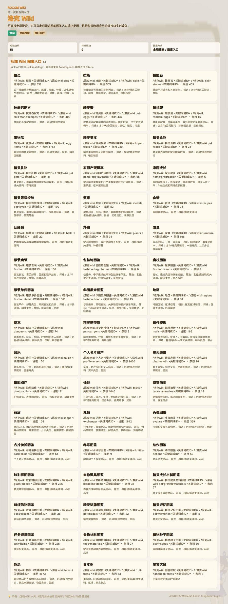 | 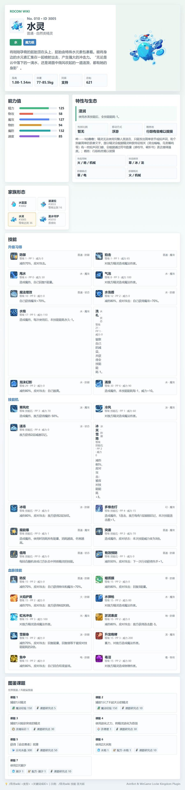 |

| `技能 Wiki：水花` | `物品 Wiki：国王球` |
|:---:|:---:|
| 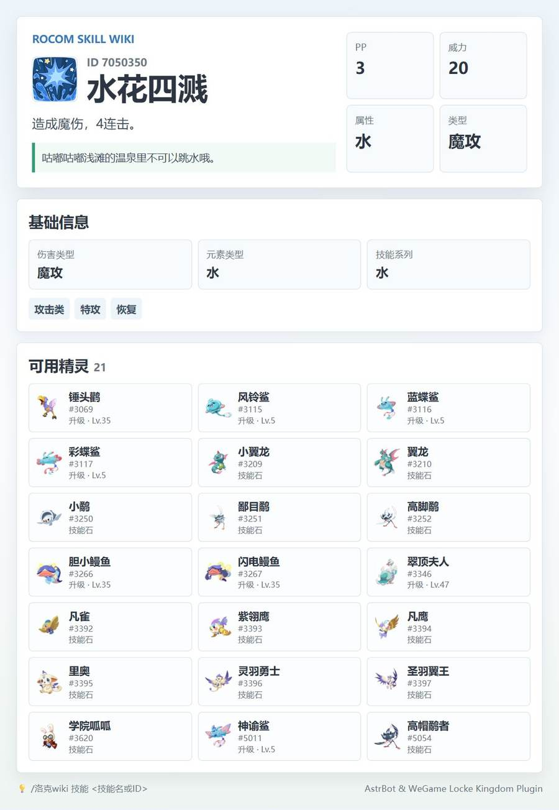 | 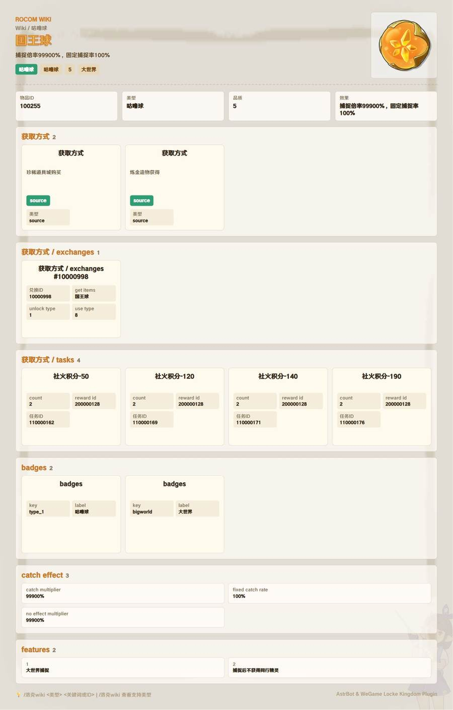 |

| `远行商人` | `洛克公告` |
|:---:|:---:|
| 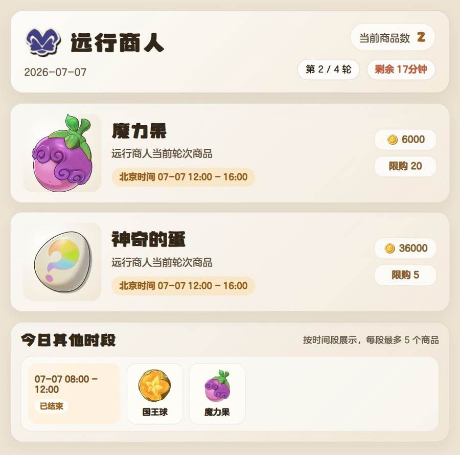 |  |

| `洛克活动日历` | `洛克家园` |
|:---:|:---:|
| 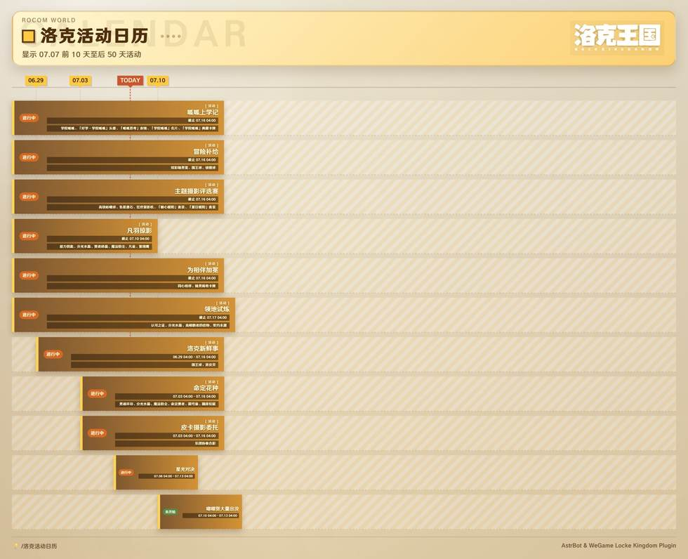 | 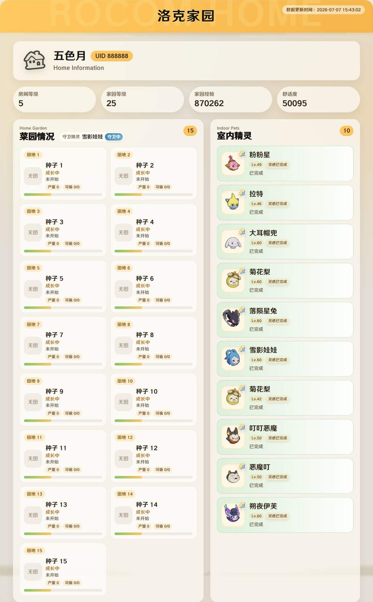 |

| `家园详情` | `查蛋结果` |
|:---:|:---:|
| 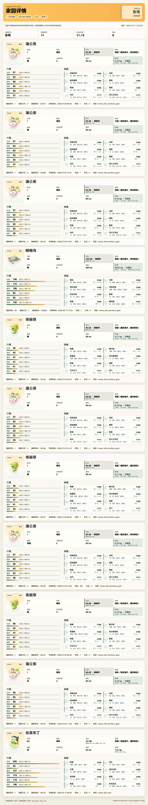 | 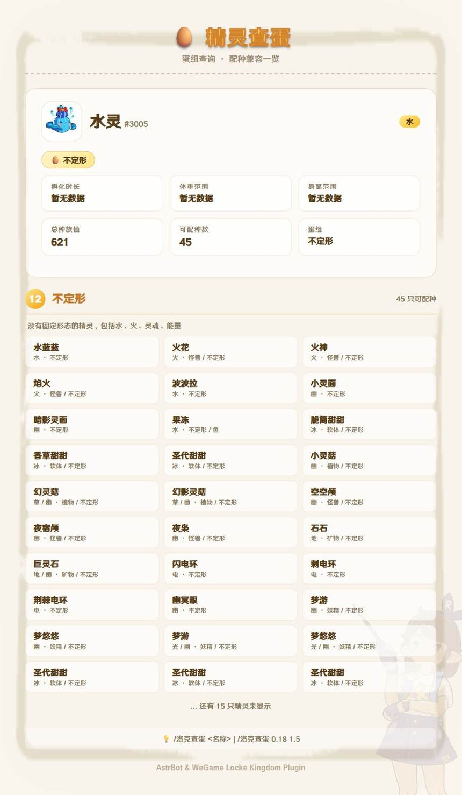 |

| `尺寸反查` | `配种结果` |
|:---:|:---:|
| 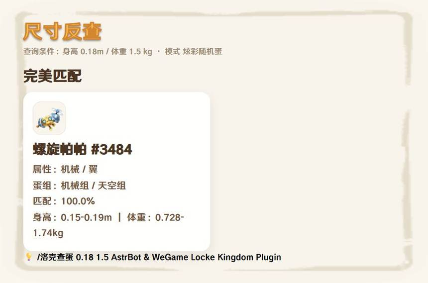 | 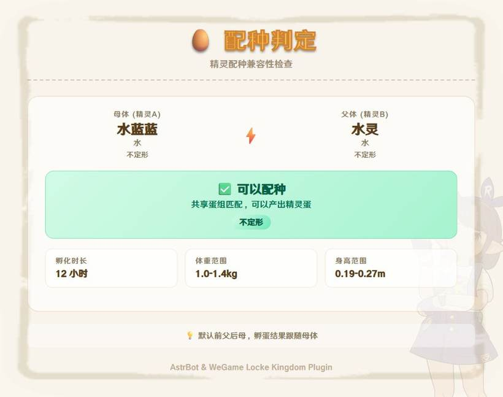 |

</details>

***

## 🎨 自定义美化

你可以通过替换内部图片的方式实现基础的背景个性化：

**路径：** `AstrBot/data/plugins/astrbot_plugin_rocom/img/`

| 功能   | 文件                       |
| :--- | :----------------------- |
| 背景图  | `bg.C8CUoi7I.jpg`        |
| 战绩背景 | `record-bg.C1mPRb4R.png` |

***

## 📋 TODO

- [x] **基础查询** (个人档案/战绩/背包)
- [x] **交换大厅** (精灵交换请求列表)
- [x] **阵容助手** (阵容列表/详情查询)
- [x] **查蛋配种** (蛋组查询/配种判定/智能搜索)
- [ ] **更多功能** (敬请期待)

***

## 📜 更新日志

<details>
<summary>点击展开版本历史</summary>

### v3.7.5 (2026-07-07)

#### 修复
- 修复远行商人等居中模板在截图前调整视口后发生裁剪偏移，导致画面左侧被截断的问题。

#### 验证
- 使用真实 API 数据测试远行商人、公告、活动日历、Wiki 菜单、玩家搜索、家园、家园详情低带宽模式和商店等主要渲染模板。

### v3.7.3 (2026-07-06)

#### 修复
- 修复 `/家园详情` 截图超时后 Playwright 页面、上下文和浏览器实例未及时清理，导致 Chromium renderer 残留占用 CPU 的问题。

#### 优化
- 低带宽模式下 `/家园详情` 会降低截图倍率、JPEG 质量和远程图片等待时间，进一步降低长图生成压力。

### v3.7.2 (2026-07-06)

#### 新增
- 新增 `low_bandwidth_mode` 低带宽模式；开启后 `/家园详情` 不再加载技能图标，适合服务器带宽较小或远程资源访问较慢的环境。

#### 优化
- `/家园详情` 图片渲染失败回退文字时，追加低带宽模式开启提示。

### v3.7.1 (2026-07-05)

#### 修复
- 优化渲染截图流程，改用页面裁剪截图并限制远程图片等待时间，降低长图在慢速资源环境下触发 Playwright 稳定等待超时的概率。

### v3.7.0 (2026-07-05)

#### 优化
- `/家园详情` 接入 Wiki 精灵体重范围，按体重范围前 5% / 后 5% 标注小块头与大块头，并在体重信息中展示判定阈值。
- `/家园详情` 基础信息区补充分贝、声线区间提示和体重体型提示，特殊分贝区间会加深色标记，去除调试型 `conf/pet_gid/npc_id/返回码` 展示。

### v3.6.1 (2026-07-05)

#### 新增
- 新增 `/家园详情 [UID] [pet_gid] [npc_id]`，适配后端 `ingame/pet/data`，支持查询目标家园摆放精灵完整数据。

#### 优化
- `/家园详情` 补全技能名称和图标，并优化家园精灵数据渲染布局。

### v3.6.0 (2026-07-04)

#### 新增
- 接入新版 RoCom Wiki API，`/洛克wiki` 作为统一入口支持精灵、技能与其它后端 Wiki 目录查询。
- `/洛克wiki` 支持无分类全局搜索，并从后端 `/wiki/catalogs` 实时读取目录、接口路径、数量和筛选参数。
- 新增 `/图鉴下载`，从 `Entropy-Increase-Team/Rocom-Atlas` 下载精灵图鉴图片、索引和 `othername/pets.yaml` 别名表到 AstrBot 插件数据目录。
- 新增 `/精灵图鉴 <精灵名>`，使用本地 Rocom-Atlas 图片查询精灵图鉴，支持 `火花 -> 火神`、`喵喵 -> 魔力猫` 等别名映射。

#### 优化
- 重建精灵 Wiki 和技能 Wiki 渲染模板，适配新版 Wiki 的精灵概览、资料、技能、家族、图鉴课题和技能可用精灵数据。
- 新增统一 Wiki 渲染模板，用于列表、详情、联想和后端目录菜单等通用 Wiki 数据。
- `/图鉴下载` 增加 20% 粒度进度提醒，并校验 Atlas 包内必须包含 `othername/pets.yaml`。
- 蛋尺寸反查改用 `/api/v1/games/rocom/wiki/pet-size/query`，兼容新版 `items[].pet / egg_size / match` 响应结构。
- 最新后端 API 文档迁移到插件目录外的 `参考文件/洛克王国文档/DOCS-API`，避免参考文件进入插件包。

### v3.5.0 (2026-07-02)

#### 优化
- 字体资源改为启动时按需下载到 AstrBot 插件数据目录，优先使用 GitCode 字体源，GitHub 固定提交源作为备用
- 插件包不再内置大体积字体文件，降低安装包体积并规避 AstrBot 插件大小限制
- 字体下载失败时自动回退系统字体栈，避免因网络问题影响插件启动

### v3.4.1 (2026-06-15)

**优化**
- 家园精灵变体标识扩展为异色、异色炫彩、炫彩三类，并使用 `img/异色.png`、`img/异色炫彩.png`、`img/炫彩.png` 新图标
- 修复家园变体图标动态路径无法被渲染器内联导致的裂图问题
- 家园长图改用 JPEG 输出压缩最终结果图体积，页面布局与渲染尺寸保持不变

### v3.4.0 (2026-06-14)

**新增**
- 新增 `/订阅家园生蛋`，在家园轮询中支持首个生蛋可领取和全部生蛋可领取提醒
- 家园精灵识别 `real_speciality_ids=103` 的异色标记，并在室内/守卫精灵展示异色图标

**优化**
- 家园查询适配后端新增的 `predicted_egg_time` 字段，室内精灵卡片会展示预计生蛋倒计时或可能已生蛋状态
- 后台轮询任务接入实例注册与旧任务清理，避免插件重载后远行商人、家园、公告订阅重复轮询

### v3.3.0 (2026-05-31)

**新增**
- 新增 `/洛克活动日历`，接入 `GET /api/v1/games/rocom/activities/info` 的活动日历数据
- 活动日历新增独立时间轴渲染模板，展示活动状态、时间范围、封面与奖励摘要

**优化**
- 适配最新后端 ingame 队列协议，`/洛克玩家` 与 `/洛克家园` 支持绑定 token 省略 UID 的查询规则
- 公告列表和公告详情按 Endfield 插件公告页面结构重构，保留洛克王国背景、字体与视觉资源

### v3.2.0 (2026-05-24)

**新增**
- 接入洛克公告列表、公告详情、最新公告查询与新公告订阅推送
- 查蛋名称查询改为后端图鉴优先，本地离线数据作为兜底

**优化**
- 家园 `home/info` 查询按新版队列协议处理：`wait_ms=5000`，收到 `202 task_id` 后轮询任务结果
- 帮助菜单和配置项同步补充公告订阅说明

### v3.1.1 (2026-05-10)

**优化**
- 远行商人当前商品卡片新增金币价格和限购数量展示
- 价格与限购从后端新增的 `random_goods` 数据中按商品名补齐，历史时段商品不展示该信息
- 远行商人渲染截图倍率与视口尺寸下调，降低推送图片体积

### v3.1.0 (2026-05-10)

**新增**
- `/洛克QQ登录` 增加小写别名 `/洛克qq登录`
- `/远行商人` 增加快捷别名 `/yxsr`
- 远行商人渲染页新增“今日其他时段”区域，按时间段展示当日其他轮次商品，每段最多展示 5 个

**优化**
- 远行商人订阅检查增加 `±30s` 随机延迟，空返回重试也加入 `±30s` 抖动，降低刷新窗口和并发请求冲突
- 家园订阅推送将 UID 展示优化为本地绑定的洛克昵称，并自动 @ 对应绑定 QQ 用户

**修复**
- 修复远行商人订阅空返回重试链路失效的问题

### v3.0.0 (2026-05-06)

**新增**
- 新增家园渲染模板，展示家园概览、菜园作物、守卫精灵和室内精灵状态
- 家园菜园接入本地作物名称与图标映射，展示作物名、图标、成熟状态、产量和可偷次数
- 家园订阅支持菜园和精灵灵感两类提醒，并按首个完成、全部完成两档推送

**优化**
- 帮助菜单和 README 同步补充家园查询、家园订阅的新版说明
- 优化家园模板中灵感完成、灵感收集中、未喂食和守卫中的视觉状态区分

### v2.7.0 (2026-04-26)

**新增**
- 远行商人订阅更新日志补充：已支持私聊订阅远行商人推送
- 新增 `/洛克家园 [UID]`，支持通过 UID 查询自己或他人的家园菜园、守卫精灵和室内精灵情况
- 新增 `/订阅家园菜园`、`/订阅家园灵感` 与 `/取消订阅家园`，支持菜园/灵感首个完成和全部完成两档提醒

**优化**
- 适配最新后端 UID 搜索队列机制，查询会优先同步等待并在返回 `task_id` 后继续异步轮询任务结果
- 保持 `/洛克玩家` 与档案补充链路的返回结构不变，兼容新的异步查询流程

### v2.6.0 (2026-04-25)

**优化**
- 重构远行商人订阅调度逻辑，不再依赖 AstrBot cron 轮询
- 远行商人订阅改为固定在每日 `08:01 / 12:01 / 16:01 / 20:01` 检查
- 若后端该轮返回空商品，则每 4 分钟最多重试 3 次，三次后暂停本轮重试

### v2.5.3 (2026-04-23)

**修复**
- 尺寸反查渲染新增独立“匹配”行，匹配率/命中次数不再混入蛋组字段
- 本地兜底尺寸反查也会展示匹配信息，同名合并时同步累加匹配率与命中次数

### v2.5.2 (2026-04-23)

**修复**
- 修正尺寸反查同名结果合并逻辑：不再剥离颜色前缀，避免误合并不同形态
- 后端尺寸查询返回的同名重复项会累加匹配率与命中次数，并聚合编号、身高、体重范围后展示

### v2.5.1 (2026-04-23)

**优化**
- 尺寸反查统一使用游戏原生 `m` 输入与展示，移除旧单位兼容分支
- 同名同色尺寸结果改为聚合展示编号与尺寸范围，避免简单去重导致数据丢失

### v2.5.0 (2026-04-22)

**新增**
- README 与帮助菜单同步补充实验性功能、暂不可用功能说明
- 远行商人订阅、自定义订阅商品、档案补充信息等现有功能文档补全

**优化**
- 洛克档案 `personal-card` 底部补充区继续调整，名片展示区精简为纯图片展示
- 帮助菜单中的实验性命令说明与当前插件实现保持一致

**修复**
- 修复洛克档案模板近期调整时引入的部分文案异常问题
- 修复档案底部名片展示与家园信息区域的对齐问题

### v2.3.0 (2026-04-21)

**新增**
- 新增 `help_prefix_display` 配置项，可仅对帮助菜单图片中的命令展示前缀做替换

**优化**
- 调整查看阵容详情渲染，补充技能名称展示并优化技能区与头像区布局

**修复**
- 修复 `查看阵容` 指令对阵容码的匹配逻辑，兼容更稳定的阵容码查找
- 修复技能 wiki 在存在精确同名项时仍被模糊结果拦截的问题
- 修复相同 UID 重新登录时旧绑定残留导致的新旧 token 数据混用问题

### v2.2.2 (2026-04-21)

**新增**
- 新增 `help_prefix_display` 配置项，仅用于帮助菜单图片中的命令前缀展示

**修复**
- 重新登录识别到相同 UID 时，会先清理旧绑定数据再写入新 token，避免旧状态残留或数据混用

### v2.2.1 (2026-04-20)

**优化**
- 帮助菜单以及查蛋相关统一切换为 `HYWenHei-85W-1.ttf` 字体
- 菜单背景新增轻量深色遮罩，降低过亮区域对文字可读性的影响
- README 同步远行商人订阅命令格式与当前权限说明

### v2.2.0 (2026-04-19)

**修复**
- 修复远行商人自定义订阅功能，现在可以正确解析自定义商品名称
- 优化命令参数解析逻辑，从 `event.message_str` 中提取完整参数避免被 AstrBot 按空格拆分

### v2.1.0 (2026-04-19)

**新增**
- 新增 `/远行商人` 指令，展示当前轮次商品
- 新增 `/订阅远行商人 1|0` 与 `/取消订阅远行商人`，支持群管理员按群配置推送方式
- 新增 Wiki 精灵与技能查询指令
- 查蛋双参数尺寸反查正式接入后端 `pet/size-query`

**优化**
- 重构精灵 wiki / 技能 wiki 渲染，补齐图标、技能列表、进化链与属性展示
- 优化远行商人渲染，仅展示当前时间段商品，并修正轮次剩余时间表达
- 查蛋结果页、尺寸反查页补充图片化输出与图标展示

**修复**
- 修复远行商人、wiki 等页面在截图时出现的截断与偏移问题
- 修复交换大厅接口在当前线上环境仍要求 `X-Framework-Token` 时的请求头兼容
- 修复远行商人标题图标路径解析异常

### v1.8.0 (2026-04-17)

**新增**
- 新增 `/洛克查蛋 <精灵名>` 指令，查询精灵蛋组、性别比、孵化信息及同蛋组可配种精灵（别名：`/查蛋`）
- 新增 `/洛克配种 <精灵A> <精灵B>` 指令，判断两只精灵能否配种并展示共享蛋组（别名：`/配种`）
- 内置 1015 只精灵离线蛋组数据（含 500 只有蛋组信息），无需登录即可使用
- 智能搜索匹配：精确匹配中文名/ID/英文名 → 唯一模糊命中自动匹配 → 多候选列表引导用户精确输入

**架构**
- 查蛋模块自包含在 `render/searcheggs/` 目录下（数据、逻辑、模板），`main.py` 仅做薄指令路由，高解耦便于后续切换后端
- 新增 `SearchResult` 类型封装搜索结果（EXACT/FUZZY/MULTI/NOT_FOUND）

### v1.7.0 (2026-04-14)

**新增**
- 新增 `/洛克刷新所有凭证` 指令（管理员专用），支持手动批量刷新所有用户凭证
- 手动刷新指令执行前会提示自动刷新功能已配置，仅作调试或强制兜底使用
- 绑定失败时不再保存无效绑定记录
- 改进绑定成功提示格式

**优化**
- 增强刷新结果统计，显示总用户数、成功数、失败数、跳过数（非 QQ 登录）
- 手动刷新指令最多显示 20 条详细结果

**修复**
- 修复自动刷新任务生命周期管理
- 修复自动刷新通知发送逻辑
- 修复绑定时未验证角色信息导致无效凭证也能成功绑定的问题
- 优化绑定失败提示，明确告知用户凭证可能无效或已过期
- 新增绑定成功时自动设置为主账号

### v1.6.0 (2026-04-14)

**新增**
- 新增自动刷新凭证功能，支持定时刷新所有用户的 QQ 登录凭证
- 支持配置刷新时间（默认每天 00:00 和 12:00）
- 支持配置刷新结果通知群号

**优化**
- 增强清理绑定统计信息，显示检查用户数、移除数和剩余数
- 优化日志记录，记录每个被删除绑定的用户 ID

**修复**
- 修复对战记录胜负判断逻辑，API 返回 1 为失败，0 为胜利
- 修复 `/洛克删除无效绑定` 指令修正为清理所有用户的无效绑定（管理员专用）
- 修复 `/洛克刷新` 指令响应检查逻辑

### v1.5.0 (2026-04-14)

**优化**
- 增强清理绑定统计信息，显示检查用户数、移除数和剩余数
- 优化日志记录，记录每个被删除绑定的用户 ID

**修复**
- 修复对战记录胜负判断逻辑，API 返回 1 为失败，0 为胜利
- `/洛克删除无效绑定` 指令修正为清理所有用户的无效绑定（管理员专用）

### v1.4.0 (2026-04-14)

**修复**
- 修复对战记录胜负判断逻辑，API 返回 1 为失败，0 为胜利

### v1.3.0 (2026-04-12)

**新增**
- 新增 `/洛克删除无效绑定` 指令（管理员）
- 新增双设备扫码提醒

**修复**
- 修复登录流程，扫码后自动绑定账号
- 修复 `/洛克刷新`、`/洛克阵容` 错误处理
- 修复洛克背包换页无效问题
- 修复登录消息缺少艾特用户

### v1.2.0 (2026-04-12)

**新增**
- 新增 `/洛克删除无效绑定` 指令
- 新增双设备扫码提醒

**优化**
- 更新登录流程，自动调用绑定 API
- 修复 `/洛克刷新` 使用正确的 API
- 优化错误处理和日志记录

### v1.1.0 (2026-04-12)

**新增**
- 新增 `/洛克交换大厅`、`/洛克阵容`、`/查看阵容` 指令
- 新增精灵背包分类筛选（全部/异色/了不起/炫彩）

**优化**
- 重构阵容页面为 2x3 网格布局
- 修复页脚显示问题
- 支持背包参数交换位置

### v1.0.0 (2026-04-11)

- ✨ 初始版本发布
- ✅ 支持 QQ/微信扫码登录
- ✅ 个人档案、战绩、背包查询
- ✅ 图片渲染输出

</details>

***

## 🙏 鸣谢

- **Astrbot**：[AstrBotDevs/AstrBot](https://github.com/AstrBotDevs/AstrBot) 提供强大的机器人开发与部署平台支撑

特别感谢：

- **熵增项目组** - 对各类抓取代理转发能力的构筑

本插件界面 UI 由原平台页面自研拆解逆向还原成微网页模板。全部图表美术素材著作及归属权属于腾讯科技 WeGame 及《洛克王国》项目组官方主体。

***

<div align="center">

### 💬 加入交流群

| 群聊                 | 群号                                           |
| :----------------- | :------------------------------------------- |
| astrbot洛克王国插件BUG反馈 | [870543663](https://qm.qq.com/q/kPxQZy5gg8)  |
| 熵增项目组洛克王国交流      | [1097809141](https://qm.qq.com/q/8SuHC3siIM) |

</div>

***

<div align="center">

# 如果喜欢这个插件，别忘了给仓库点个⭐！

# [⬆ 返回顶部](#-astrbot_plugin_rocom)

</div>
