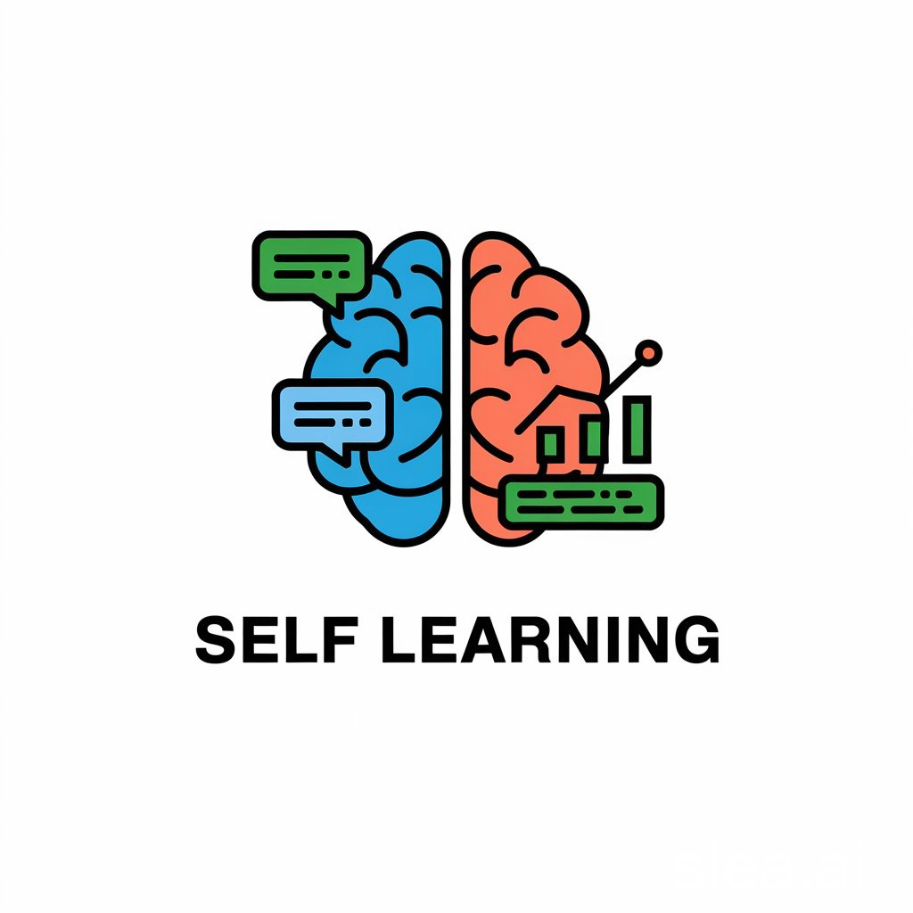

<div align="center">

**English** | **[中文](README.md)**

<br>



<br>

# AstrBot Self-Learning Plugin

**Make your AI chatbot learn, think, and converse like a real person**

<br>

[](https://github.com/NickCharlie/astrbot_plugin_self_learning) [](LICENSE) [](https://github.com/Soulter/AstrBot) [](https://www.python.org/)

[Features](#what-we-can-do) · [Quick Start](#quick-start) · [Web UI](#visual-management-interface) · [Community](#community) · [Contributing](CONTRIBUTING.md)

</div>

<br>

> **Copyright and License / 版权与许可**
>
> **Author**: NickMo / Mo Zhiping — nickmo318@outlook.com / max318515692@gmail.com; [EterUltimate](https://github.com/EterUltimate)
> **Maintainer**: [EterUltimate](https://github.com/EterUltimate)
> **Copyright**: Copyright (c) 2025-2026 NickMo (Mo Zhiping). All rights reserved (for personal components).
> **License**: Licensed under [**AGPL-3.0**](LICENSE). This project incorporates and is a derivative work of [AstrBot](https://github.com/AstrBotDevs/AstrBot) (also AGPL-3.0). Any modifications or derivative works must be distributed under the same license.
>
> **作者**: NickMo / Mo Zhiping (莫志平) — nickmo318@outlook.com / max318515692@gmail.com；[EterUltimate](https://github.com/EterUltimate)
> **维护者**: [EterUltimate](https://github.com/EterUltimate)
> **版权所有**: Copyright (c) 2025-2026 NickMo (Mo Zhiping). All rights reserved (for personal components).
> **许可协议**: 本项目采用 [**AGPL-3.0**](LICENSE) 开源协议，包含并衍生自 [AstrBot](https://github.com/AstrBotDevs/AstrBot)（同为 AGPL-3.0）。基于本仓库的修改或衍生作品必须以相同协议分发。

<br>

> [!WARNING]
> **Please manually back up your persona files before use, in case bugs cause persona corruption.**

<details>
<summary><strong>Disclaimer & User Agreement (click to expand)</strong></summary>

<br>

**By using this project, you acknowledge that you have read, understood, and agreed to the following terms:**

1. **Lawful Use Commitment**
   - This project is intended solely for learning, research, and lawful purposes
   - **It is strictly prohibited to use this project directly or indirectly for any purpose that violates applicable laws and regulations**
   - Including but not limited to: privacy invasion, illegal data collection, malicious information dissemination, violation of platform terms of service, etc.

2. **Privacy Protection Responsibilities**
   - Users must comply with applicable privacy and data protection laws in their jurisdiction
   - Explicit user consent must be obtained before collecting and processing message data
   - Collected data must not be used for commercial purposes or disclosed to third parties
   - It is recommended to use only in private environments or groups where all participants have given consent

3. **Risk Disclaimer**
   - This project is provided "AS IS" without any express or implied warranties
   - The developer is not responsible for any direct or indirect damages caused by using this project
   - Users assume all risks including data loss, persona corruption, and system crashes
   - **Thorough testing before production use is strongly recommended**

4. **Developer Disclaimer**
   - The developer bears no responsibility for users' illegal or non-compliant usage
   - Users bear full responsibility for any legal disputes arising from misuse
   - The developer reserves the right to modify or discontinue this project at any time

5. **Agreement Changes**
   - This agreement may be updated at any time without prior notice
   - Continued use of this project constitutes acceptance of updated terms

**Important: By downloading, installing, or using any functionality of this project, you are deemed to have fully understood and agreed to comply with all of the above terms. If you do not agree, please immediately stop using and delete this project.**

</details>

---

## What We Can Do

### Conversation Style Learning — Make Your Bot Talk Like a Real Person

Your bot can automatically observe and learn a specific user's speaking style — catchphrases, expression habits, tone markers, even distinctive punctuation usage. Learning is continuous: the more the bot observes, the more natural and human-like its expressions become.

It doesn't just copy individual sentences. It understands **which expressions to use in which situations** — how to speak when happy, how to comfort someone, how to complain.

### Social Relationship Insight — See Through Who's Really Close in the Group

This is one of our most interesting features. The plugin automatically analyzes social relationships between group chat members and generates a visual relationship graph.

We can identify **22 relationship types**, including but not limited to:

| Category | Identifiable Relationships |
|----------|---------------------------|
| **Daily Interaction** | Frequent interaction, Reply conversations, Topic discussions, Q&A, Agreement, Debates |
| **Social Ties** | Best friends, Colleagues, Classmates, Teacher-student |
| **Family Relations** | Parent-child, Siblings, Relatives |
| **Intimate Relations** | Couples, Spouses, **Ambiguous relationships**, **Inappropriate relationships** |
| **Special Relations** | Enemies, Rivals, Admirers, Idol-fan |

Yes, **ambiguous and inappropriate relationships can be detected too**. By analyzing nicknames, tone, interaction frequency, and intimacy levels in chat messages, the plugin can uncover those "unusual" connections. Each relationship type is color-coded on the graph, with relationship strength and interaction frequency visible at a glance.

You can filter to view all relationships for a specific member, or get an overview of the entire group's social network.

### Adaptive Persona Evolution — Your Bot's Personality Grows on Its Own

Traditional bot personas are static — whatever personality you set, it stays that way forever. We're different.

This plugin **automatically generates persona update suggestions** based on learned conversation styles, group atmosphere, and user feedback. Every update goes through a review mechanism: you can compare the "original persona" with the "proposed changes" in the management interface and decide whether to adopt them.

A persona isn't written once and forgotten — it **continuously evolves and keeps growing**.

### Group Slang Understanding — No More Embarrassing Misunderstandings

Every group has its own "dialect." "Jackpot" might mean surprise, "next time for sure" is actually a polite refusal, and a certain emoji might mean something completely different from its literal meaning.

Regular bots get confused by these and embarrass themselves. This plugin automatically detects and learns group-specific slang, understands their real meanings, and uses them correctly in conversations. **Your bot won't blow its cover by "not understanding the lingo" anymore.**

### Affection System — Different Attitudes for Different People

The bot remembers the closeness of its relationship with each user. For users who chat often and interact kindly, the bot responds with more warmth and enthusiasm. For users with poor attitudes, the bot's replies become cold or even sharp.

Affection naturally decays over time — **no contact means gradually drifting apart**, just like real-life relationships. Each user has a cap of 100 points, and the bot's total affection has an upper limit — it can't be equally devoted to everyone.

### Mood System — Your Bot Has Good Days and Bad Days Too

The bot is no longer a machine with permanently stable emotions. It experiences happiness, sadness, excitement, anxiety, playfulness, curiosity, and other emotional states that change naturally over time and through interactions.

When in a good mood, replies are more energetic and humorous. When in a bad mood, it might be slightly negative or dismissive. **This makes every conversation slightly different, making the bot feel more real.**

### Goal-Driven Conversation — Not Just Responding, But Actively Guiding

Traditional bots only react — "you say something, I answer." This plugin's bot can automatically identify the user's conversational intent — whether they need comfort, want to chat casually, are venting, or asking for help — and **actively guides the conversation direction** based on the detected intent.

It supports 38 conversation scenarios covering emotional support, information exchange, entertainment, social interaction, conflict handling, and more. The bot acts like a real conversationalist who knows when to listen, when to respond, and when to change the subject.

### Memory Graph — Remembers Everything You've Talked About

The bot no longer has "goldfish memory." It automatically extracts key information from conversations, builds a knowledge association network, and forms genuine long-term memory.

Topics discussed last week, preferences you've mentioned, funny moments between you — the bot remembers all of it and brings things up naturally at the right time. **This feeling of "being remembered" is the key to making a bot feel like a real person.**

---

## Visual Management Interface

The plugin comes with a macOS-style web management interface (port 7833). All features are visually operable — no command line needed.

**Statistics Dashboard**


**Persona Management & Review**


**Conversation Style Learning Tracker**


**Social Relationship Graph**


---

## Quick Start

### Installation

```bash
cd /path/to/astrbot/data/plugins
git clone https://github.com/NickCharlie/astrbot_plugin_self_learning.git
```

Start AstrBot and the plugin loads automatically.

The plugin does not install dependencies during install or startup. After the plugin is installed, open the Web UI System Settings page and manually click "Install Dependencies"; dependency installation is triggered only by that manual confirmation.

### Access the Management Interface

```
http://localhost:7833
```

The pack branch WebUI is passwordless by default and opens the management interface directly.

### Basic Configuration

Set the following key items in the AstrBot admin panel:

- **Learning Target** — Specify user QQ IDs to learn from (leave empty to learn from everyone)
- **Model Configuration** — Set the Provider IDs for filter and refinement models
- **Learning Frequency** — Auto-learning interval (default: 6 hours)
- **Database** — Defaults to PostgreSQL with automatic database/schema/table creation; SQLite and MySQL remain available as explicit choices

More configuration options are available in the WebUI settings page.

---

## Commands

| Command | Description |
|---------|-------------|
| `/learning_status` | View learning status and statistics |
| `/start_learning` | Manually start learning |
| `/stop_learning` | Stop automatic learning |
| `/force_learning` | Force execute one learning cycle |
| `/remember <context> => <example>` | Manually remember conversation context and link it to expression/few-shot examples |
| `/affection_status` | View affection leaderboard |
| `/set_mood <type>` | Set bot mood |

All commands require admin privileges.

---

## Recommended Companion

**[Group Chat Plus Plugin](https://github.com/Him666233/astrbot_plugin_group_chat_plus)**

The two plugins complement each other perfectly: this plugin handles **learning and persona optimization**, while Group Chat Plus handles **intelligent reply decisions and social awareness**. Together, your bot can both learn and navigate social situations.

---

## Community

- QQ Group: **1021544792** (ChatPlus plugin users + Self-Learning plugin users)
- [Report Bugs](https://github.com/NickCharlie/astrbot_plugin_self_learning/issues)
- [Feature Requests](https://github.com/NickCharlie/astrbot_plugin_self_learning/issues/new?template=feature_request.md)
- [Contribute Code](CONTRIBUTING.md)

---

## License

This project is licensed under the [AGPL-3.0 License](LICENSE).

### Special Thanks

- **[MaiBot](https://github.com/Mai-with-u/MaiBot)** — Core design concepts including expression pattern learning and knowledge graph management
- **[AstrBot](https://github.com/Soulter/AstrBot)** — Excellent chatbot framework

### Contributors

<a href="https://github.com/NickCharlie/astrbot_plugin_self_learning/graphs/contributors">
  
</a>

---

<div align="center">

**If you find this helpful, please give us a Star!**

[Back to top](#astrbot-self-learning-plugin)

</div>
